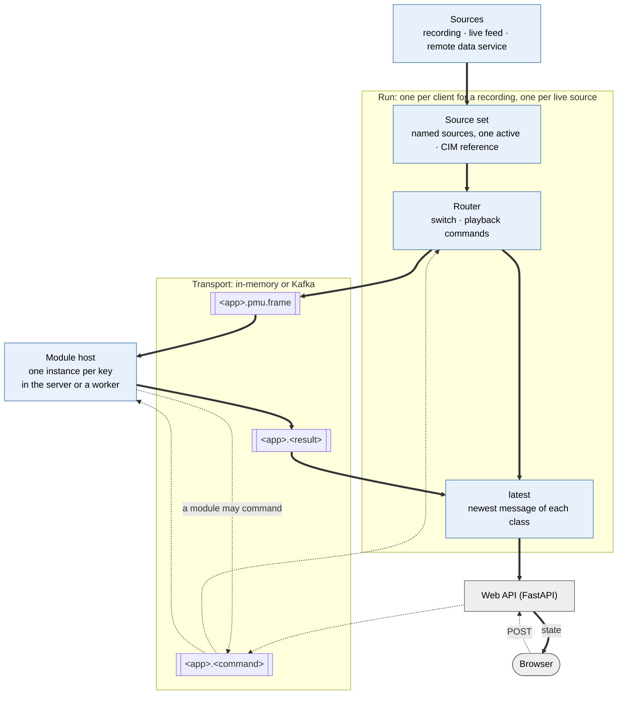

# The server data architecture

How PMU data gets from a source, through analysis modules, to the browser, and
how a command gets back up. The shared pieces live in `core/` (the
`pswamp_core` package). The PMU test streamer (`/pmu-test-streamer`) is the
worked example of every piece.

| If you want to… | Read |
|---|---|
| add a module and its page | `doc/module-cookbook.md` |
| serve a deployment's history to p-SWAMP | `doc/remote-data-integration-contract.md` |
| understand a piece | "The pieces" below, then the class docstrings |

## What it has to do

- Take PMU data from several kinds of source: a recording, a live feed, or a
  remote data service run by the deployment.
- Pass it through swappable analysis **modules**, each with a clear contract
  for what it reads and what it publishes, and on to the web frontend.
- Let a module run in the server or in a process of its own (a pod, a compose
  service), so a heavy module cannot stall the rest.
- Declare a **pipeline**: its sources and the modules that process them.
- Carry messages over topics behind a **transport** interface. Kafka is the
  default; replacing it (with NATS, say) means adding one class.
- Send typed **commands** upstream from any part, handled by the part that
  declares them.
- Add a CIM reference to each frame early, so any module can look up grid
  data.
- Share a live pipeline between every viewer. Give each client (browser, by
  client id) its own replay of recorded data.
- Run the same way in compose, in minikube, and in a cloud cluster.

## Vocabulary

| Term | Meaning |
|---|---|
| message | A pydantic model with a schema version. Everything that crosses a topic, a socket or a process boundary is one. |
| `PmuFrame` | One instant of every channel in a stream, carrying its channel layout (`PmuHeader`). |
| source (`SourceModule`) | One source of data, written as a module: a *history* (seekable) or a *live* feed (tailed from now). A history that is `Playable` also paces itself and answers the transport controls. |
| source set (`SourceSet`) | A run's sources as named instances, one of them active. Enriches every frame on the way out. |
| router (`ActiveSource`) | A run's receiver of `SwitchSourceCommand` and the playback commands: switches the active source and hands the playback commands to it. Reported as "the player" to the page and in errors. |
| transport | Keyed publish/subscribe: in-memory in one process, or Kafka between processes. |
| topic | `<app>.<message class>`, e.g. `pmu-test-streamer.pmu.frame`. One class per topic. |
| key | Which pipeline run a record belongs to: a client id, or `live.<source>`. |
| module | p-SWAMP's microservice: one analysis that reads one message class, publishes a result class, may answer commands, and can run in a process of its own. |
| host / worker | A host runs one module instance per key. A worker is a process that runs hosts. |
| pipeline | The declaration: an app's sources and modules. |
| run | One running pipeline under one key: a source set, a router over it, and the latest message of each class. |
| web API | An app's FastAPI package under `/api/<app>/`, which the browser talks to: POSTs become commands, and the socket pushes state. `doc/the-client-server-api.md` describes the convention. |
| command | A typed message going upstream. Its class decides who handles it. |

## The reference example

The PMU test streamer (`/pmu-test-streamer`) is the app every example below
is taken from. It is not part of the core: it is one pipeline built on it,
kept complete so each piece has a working instance to read. Its modules are
projects in `modules/` (`frame-stats/`, `excursion/`, `range-summary/`), and so
are its sources (`sample-replay/`, `live-synthetic/`, `remote-history/`); its
pipeline is `pipelines/pmu-test-streamer.toml`. Its parts:

| Part | What it is |
|---|---|
| sources | `sample`: a 3 s recording of five stations at 20 Hz, spanning a line trip. `live`: the same frames stamped now, as a live feed. `remote` (compose and k8s): the recording again, served by the remote data stub. |
| `FrameStatsModule` (`frame-stats`) | Reads every `PmuFrame`. Publishes a `FrameStatsResult`: the mean, lowest and highest frequency across the stations at that instant, the voltage angle spread and the mean voltage. |
| `ExcursionModule` (`excursion`) | Reads every `FrameStatsResult`, so it is chained onto the module above. Publishes an `ExcursionResult`: whether the mean frequency is within ±0.005 Hz of 50 Hz, and how many times it has left that band. After an `AutoPauseCommand` it pauses the player when the frequency leaves the band. |
| `RangeSummaryModule` (`range-summary`) | Reads no stream. On a `SummarizeRangeCommand` it reads a time range of a recording itself and publishes a `RangeSummaryResult`: the frames in the range and their lowest, highest and mean frequency. |
| web API and page | `app/server-python/src/pmu_test_streamer/api.py` and the page at `/pmu-test-streamer`: the player's controls, the three results, and a control for each module command. |

## The picture

```
DATA DOWN    active source (enrich) → topic <app>.pmu.frame → module → topic <app>.<result>
             → the run's latest → web API → socket → browser
COMMANDS UP  browser → POST → web API → topic <app>.<command> → router → active source | module
             a module may publish a command too
WHERE        in-memory transport: modules hosted in the server; Kafka: modules in workers
```



Thick arrows carry data and dotted arrows carry commands. Every arrow carries a
message, and the browser's TypeScript types are generated from the same
classes.

## Per client and shared

| | Recorded source | Live source |
|---|---|---|
| run key | the client id | `live.<source>` |
| runs | one per client, with its own cursor and speed | one per live source, always on |
| player controls | play, pause, step, seek, speed | none: a live feed is followed |
| modules | one instance per client | one instance, results shared |

*What.* Each client has its own run, and picks its source with
`SwitchSourceCommand`. On a recording, the active source replays it (it is
`Playable`). Each
live source has one shared run, keyed `live.<source>`, which `serve_pipeline`
starts with the app (`start_live_runs`) and stops at shutdown. A client's run
switched to a live source opens no stream: its router reports "live", and the
run follows the shared run's frame and result topics into its own `latest`.
The web API reads a client's run the same way in both cases.

*Why.* Everyone watching live must see the same instant, and its analysis
should run once, however many people watch. A visitor exploring recorded data
wants their own clock. Always on means live analysis runs with no viewer too,
as it would in a control room. Topics are shared by every key of an app; the
record key keeps runs apart.

*Where.* `core/src/pswamp_core/pipeline.py` (`start_live_runs`,
`PipelineRun._follow`), `active_source.py` (`follow_live`), `shared.serve_pipeline`.

## Where it runs

With no transport configured, the server uses the in-memory transport and
hosts the modules itself: one container, no broker. Tests and CI use this
mode. In compose and k8s, the server and one or more workers share a Kafka
broker, and each worker hosts the modules it is told to. The code path is the
same in both; only the transport differs.

A worker is the same image running `python -m pswamp_core.worker`, configured
by the same transport variables as the server plus:

```
PSWAMP_WORKER_PIPELINES=pmu-test-streamer.toml   # pipeline files whose modules to host (relative to the working directory)
PSWAMP_WORKER_MODULES=range-summary              # optional: only these
```

So a heavy module gets a process, with CPU and memory limits of its own,
without touching its code or its page. "A module in a worker of its own",
under Deployment, shows the change in compose and in k8s.

**The code is layered so a worker needs no web backend:**

```
models/   pswamp-models    every message, one package per producer (pydantic only)
core/     pswamp-core      transport, module contract, sources, router, pipelines
modules/<name>/        pswamp-<name>   one project per module or source (pswamp_modules.<pkg>, a namespace portion)
pipelines/<app>.toml                   each app's pipeline, as data (not a project)
app/server-python          the web API of each app, and the server
```

Each depends only on those above it. A module imports the core and the models
and nothing else (not another module), and so do the sources, so
a worker imports models, core, the modules and the wiring, from any working
directory. An app's web API loads its pipeline file (`Pipeline.load`), which
names its modules by entry point, and imports its results and commands from
`pswamp_models`.
A module is one project, holding its code, its tests, a README and examples.
`tools/tests/test_tools_layering.py` and
`models/tests/test_models_layering.py` check the layering.

## The pieces

### Messages
*What.* Every message is a `DataModel`: a pydantic model with a pinned schema
`version`, an optional `mRID` and a UTC `timestamp`. Its topic is its class
name (`PmuFrame` → `pmu.frame`).

```python
class FrameStats(BaseModel):
    mean_hz: float

class FrameStatsResult(ResultEnvelope[FrameStats]):   # topic frame.stats.result
    version: Literal["v1"] = "v1"

FrameStatsResult.model_validate_json(text)           # the whole codec
```

| Message | Carries |
|---|---|
| `PmuFrame` | One instant of every channel, with its `PmuHeader` (station, channel, measurement and unit per column, data rate, `cimReferenceId`, `header_id`). |
| `Command` | An upstream action. The player's are `Play`, `Pause`, `Step`, `Seek`, `Speed` and `SwitchSource`; a module declares its own. |
| `PlayerStatus` | The player's mode, source, cursor, speed and what it can do. |
| `ResultEnvelope[T]` | A module's result body `T`, with the module's identity and the command it answers, if any. |
| `ErrorEvent` | An operational failure, for the person using the run. |
| `PipelineClosed` | A run stopped; hosts drop its module instances. |

*Why.* One codec from provider to browser. A message can be logged,
validated on receipt, and published in the browser's api contract without an
adapter. A pinned version makes an incompatible payload fail loudly. Every
frame carries its layout, so a module needs nothing but the frame in hand.

*Where.* `models/src/pswamp_models/`, one package per producer: `common/`,
`player/`, `pmu/`, `remote_data/`, and one per module (`frame_stats/`, …).

### Transport
*What.* Keyed publish/subscribe: **one topic per message class, per app, and
the run's key on every record**.

```python
await transport.publish(frame, app="pmu-test-streamer", key="42")   # topic pmu-test-streamer.pmu.frame
with transport.subscribe(FrameStatsResult, app="pmu-test-streamer", key="42") as results:
    async for key, result in results: ...                          # key "42" only
with transport.subscribe(PmuFrame, app="pmu-test-streamer") as frames:
    async for key, frame in frames: ...                            # every key: a module host's view
```

The deployment picks the implementation with `PSWAMP_TRANSPORT`
(`name:module.path:Class`, plus that name's `{NAME}_{SETTING}` variables).
Unset, it is the `InMemoryTransport`. The player and modules publish
synchronously into an `Outbox`, which sends in order and, when full, drops the
oldest data message, but never a command, an answer to one, or an error.

Two classes of one name have the same topic. `subscribe` refuses the second
class on a topic, and `Pipeline` refuses to declare both. Rename one, or give
it a topic of its own (`topic: ClassVar[str]`).

*Why.*
- **One mechanism.** A module is always reached over the transport, so "in
  the server" and "in a worker" are two transports, not two code paths.
- **The in-memory transport behaves like a broker.** Every message goes
  through JSON, and a topic carries one exact class. A message that would not
  survive Kafka fails in a unit test.
- **Replaceable.** A new transport implements `publish` (and `_watch` for
  incoming topics) and passes `core/tests/transport_suite.py`.
- **A transport is not a data source.** It carries what is published, in
  order, and keeps nothing for late subscribers.

**Kafka.** `KafkaTransport` (`kafka:pswamp_core.transport.kafka:KafkaTransport`
with `KAFKA_BOOTSTRAP_SERVERS`) creates each topic with one partition and
about a minute of retention. It reads every topic its process listens to with
one consumer, from the topic's end, with no consumer group. Compose runs the
broker as `kafka` (Apache Kafka, one KRaft node, no volume).

*Where.* `core/src/pswamp_core/transport/`, `subscription.py`, `settings.py`
(spec loading, shared with the data providers); `core/tests/transport_suite.py`
(run against the compose broker with
`KAFKA_TEST_BOOTSTRAP_SERVERS=127.0.0.1:19092`).

### Modules
*What.* A module is p-SWAMP's microservice: one analysis with declared inputs
and outputs, which runs inside the server or in a process of its own. Its
code is synchronous; it may also answer commands.

```python
class FrameStatsModule(Module):
    name = "frame-stats"
    inputs = (PmuFrame,)
    outputs = (FrameStatsResult,)              # a ResultEnvelope[FrameStats]

    def process(self, frame: PmuFrame) -> FrameStats | None: ...
```

It reads its inputs in one of three styles: one input and `process`; several
independent ones, each with an `@on(Model)` handler; or named inputs that a
join (`Latest(trigger=..., max_age=..., missing=...)`) combines into one
`process(*, name=...)` call. A handler returns a body (wrapped in the declared
envelope), any other declared output as it is, a list, or `None`. The same
module runs from a script: `FrameStatsModule().run_one(frame)`.

A module that answers commands lists their concrete classes in `commands`
and implements `handle` (or `async def ahandle`, when the answer must await),
and `validate` if it can refuse one. What it returns is published like a
`process` result, carrying the command's `request_id`. A refusal or failure is
published as an `ErrorEvent` carrying it too.

A `ModuleHost` runs a module. It subscribes to every input and command topic
of the module for every key, and builds one instance per run key on that
key's first message. With a join, only the trigger input is queued; the others
only replace the newest of their kind. It drops the instance when the run publishes `PipelineClosed`, or
after five minutes with nothing for it.

An instance that fails (its `setup` raises, say) is logged, reported as an
`ErrorEvent` under its key, and dropped. The first message for that key five
seconds later builds a new one; what arrives before is ignored. A `process`
that raises, or returns a body that does not fit the envelope or a class it
does not declare, costs only that input: it is reported and the next one is
read.

**A pipeline of modules.** The streamer's three modules ("The reference
example") show the three things a module can do beyond reading frames:

- **Read another module's results.** Listing in `inputs` another
  module's result class chains them. The streamer's `ExcursionModule` reads
  what its `FrameStatsModule` publishes: `PmuFrame` → `FrameStatsModule` →
  `FrameStatsResult` → `ExcursionModule` → `ExcursionResult`. The link is the
  topic, so the two may run in different workers.
- **Command the player.** A command is one more declared output.
  `ExcursionModule` (`outputs = (ExcursionResult, PauseCommand)`) returns
  `PauseCommand` when the frequency leaves its band and auto-pause is on, and
  the player applies it exactly as one from the web API. A pipeline refuses a
  module that sends a command nothing in it takes.
- **Read data itself.** A module that sets `reads_sources = True` gets its
  own `SourceSet` over the pipeline's sources (`self.sources`). The streamer's
  `RangeSummaryModule` answers `SummarizeRangeCommand` with it: a batch query,
  which compose and k8s run in a worker of its own.

*Why.* A contributor writes the analysis and three class attributes. The
module never sees the transport: `process` takes messages and returns
messages. That lets the same module run in the server, in a worker or in a
plain script. Reading the layout off `frame.header` means it needs no
configuration. `process` runs on the event loop; a CPU-heavy module sets
`blocking = True` to run it in a thread.

*Where.* `core/src/pswamp_core/modules.py`, `host.py`, `command_routing.py`;
a module is a project under `modules/`, and the
streamer's are `frame-stats/`, `excursion/` and `range-summary/`.

### Sources
*What.* A source is a module of its own kind (`SourceModule`, a project under
`modules/`, found by its entry point like any module). It reads nothing and
produces `PmuFrame`s. It is a `history` (it holds a range, reports it as
`coverage`, and yields any part of it) or a `live` feed (it yields records as
they arrive). The author writes one of `read` (plain code, for a script too) or
`aread`; the base derives the other. A history that mixes in `Playable` is also
its own player: it paces, seeks, steps, loops and answers the playback commands.
A `SourceSet` holds a run's sources as named instances, one of them active.

```python
class SampleReplay(Playable, SourceModule):
    name = "sample-replay"
    kind = "history"
    def coverage(self): return self.recording.coverage          # [first, end)
    def read(self, start=None, end=None):
        for frame in self.recording.frames:
            if TimeRange(start, end).contains(frame.timestamp):
                yield frame

sources = SourceSet([SampleReplay("sample"), LiveSynthetic("live")])
sources.switch("live")                            # only an explicit switch changes the source
stream = await sources.consume(start=t0)          # a seek
chunk = await sources.consume(start=t0, end=t1)   # exactly [t0, t1)
```

*Why.* A source is written against the contract alone, so a deployment can
write its own outside this repo. `pswamp_core.testing.SourceConformance` is the executable
contract: inherit it, supply the source, and pytest checks it. With one source
active at a time, a stream always has exactly one source behind it. "Jump to a
time" and "query a chunk" are the same call. The set opens a source on first
use, so one nobody reads costs nothing. History lives with the source: the
repo stores nothing.

**Configured, not coded.** An app's sources are the `[[sources]]` of its
pipeline file (`pipelines/<app>.toml`; `name` and `module`, an entry point; the
first is the default), which `<APP>_SOURCES` (`name:entry-point,...`) replaces
when set. Each source reads its own `{NAME}_{SETTING}` variables:

```
PMU_TEST_STREAMER_SOURCES=sample:sample-replay,live:acme-feed
LIVE_BOOTSTRAP_SERVERS=kafka.acme:9092
```

A deployment plugs in its own source with one package in the image and one
variable. (`<APP>_DATA_CLIENTS` of the old data clients is no longer read, and
setting it is an error that says so.)

*Where.* `core/src/pswamp_core/sources.py`, `playable.py`, `settings.py`,
`testing.py`; the examples are `modules/sample-replay/` (history, playable) and
`modules/live-synthetic/` (live: the sample re-stamped on the wall clock).

### CIM reference
*What.* The source set sets an optional `PmuHeader.cimReferenceId` on every
frame: an id for the grid (CIM) data that applies to it. Enrichers passed to a
`SourceSet` run on every record its streams yield. `CimReferenceEnricher`
decides the reference once per layout. **It is a stub**: it returns one
configured id (`PMU_TEST_STREAMER_CIM_REFERENCE`, default `n44-cim-stub`,
`none` for none). A lookup against a CIM model overrides `reference_for` and
nothing else changes.

*Why.* Every reader's frames pass through the source set, so every module sees
the same reference, decided once, early. It travels with the frame, so a module
in a worker gets it with no configuration of its own. It is a reference, not
the grid data itself, which would cost kilobytes per frame.

*Where.* `core/src/pswamp_core/enrich.py`; wired in
`pipelines/pmu-test-streamer.toml` (`[enrich] cim_reference`).

### The router and playable sources
*What.* A run's `ActiveSource` router receives `SwitchSourceCommand` and the
playback commands. A switch stops the active source and starts the new one; a
playback command goes to the active source when it is `Playable`, and is
refused (`<command> does not apply to a live source`) when it is not. A source
that is not playable is pumped: its frames go out as they arrive.

```python
router = ActiveSource(sources, sink, loop=True)
await router.start()        # a recording: paused at its start; a live feed: followed from now
router.validate(command)    # raises CommandRefused: the web API's 409
await router.handle(command)
router.status()             # PlayerStatus: mode, source, cursor, speed, can_seek, error, ...
```

*Why.* A source yields as fast as it reads, but a person watching a
disturbance needs real time and needs to scrub. The rules, which the
`Playable` source carries:

- **Mode is the active source's kind.** A recording is replayed: paced, seekable,
  looping at its end. A live feed is followed, with no transport controls. The
  status carries `mode`, `sources` and `can_seek`, so a page shows no dead
  buttons.
- **Paused, it shows the frame at its cursor.** Start, seek, step and a switch
  to a recording each publish the frame there.
- **A seek is a new stream.** A seek with `end_offset_s` plays that chunk and
  stops, paused.
- **Pacing drops time rather than bursting** when it falls behind.
- **A provider failure stops the stream loudly**: paused, `error` set, an
  `ErrorEvent` published. Play tries again.
- **One task** reads the stream, paces, and applies the commands `handle`
  queues for it. No locks, and a quiet live feed never delays a command.
- **The speed belongs to the run:** it carries over when another recording is
  switched to.

*Where.* `core/src/pswamp_core/active_source.py` (the router) and
`playable.py` (the pacing).

### Pipelines and runs
*What.* A `Pipeline` declares an app's pipeline once: the app name (its topic
namespace), its sources and its modules. A `PipelineRun` is one running
instance under one key. A `PipelineRegistry` keeps one run per key.

```python
PIPELINE = Pipeline.load("pipelines/pmu-test-streamer.toml")   # or Pipeline(app, sources, modules=...) in a test

REGISTRY = PipelineRegistry(lambda key: PipelineRun(key, PIPELINE, transport))
run = await REGISTRY.acquire(client_id)       # built on first connect
run.latest.get(FrameStatsResult)              # the newest result: what the web API sends
with run.changes() as changes: ...            # a wake-up per change, coalesced
REGISTRY.peek(client_id)                      # a command's view: never builds
```

*Why.* The declaration is what both sides share. The server builds runs from
it, and a module host, in the server or a worker, hosts its modules from it
(`PIPELINE.hosts(transport)`). A run holds a source set and a router, publishes
the active source's frames to the modules, and keeps the newest message of each class
it sees. That view is not a bus: the web API builds its message from current
state, so however much arrived meanwhile, it sends one. The registry lets a
run outlive its sockets for five minutes, so a reload rejoins it. At its cap
(8) it evicts the least recently used idle run, and refuses when every run is
watched.

*Where.* `core/src/pswamp_core/pipeline.py`, `worker.py`;
`core/src/pswamp_core/pipeline_config.py` (`Pipeline.load`: the pipeline file, its schema,
modules by entry point, the producer check); `pipelines/pmu-test-streamer.toml`.

### Commands
*What.* A command's class is its address. Exactly one part of a pipeline
declares that it handles it: the router (for the player commands), or one module. The command travels on
its own topic, `<app>.<command>`, under the run's key.

```python
run.dispatch(SeekCommand(client_id=id, offset_s=12))
#   a player command?  router.validate(cmd)    raises CommandRefused: the POST's 409
#   a module command?  published as it is       the module validates it where it runs
#   nobody takes it?   NoReceiver
#   then               topic pmu-test-streamer.seek.command, key = the run's key
# the receiver's CommandInbox: validate again, then handle; a refusal is an ErrorEvent(request_id)
```

*Why.* The mental model is one sentence: **anyone may publish a command, its
one declared receiver applies it, anyone may subscribe to watch it.** The
arguments are validated fields, not a verb and a dict. `Pipeline` refuses two
receivers of one class. The router lives in the server, beside the web API,
so its commands are checked before they are published, and a refusal is an
honest 409. A module may run in another process, so its commands are checked
where it runs, and a refusal comes back as an `ErrorEvent`. Player commands
also travel on topics, so a module can command the player exactly as the web
API does.

*Where.* `core/src/pswamp_core/command_routing.py`, `models/src/pswamp_models/player/commands.py`,
`pipeline.py` (`dispatch`).

### The web API
*What.* The app's FastAPI package (`api.py`), mounted under `/api/<app>/`:
what the browser talks to. It is an app like any other in this server and
follows the same convention, described in `doc/the-client-server-api.md`:
commands up as POSTs, state down one socket. Over a pipeline it keeps only
what the core does not do: the state message it pushes, and the POSTs that
build commands.

```python
REGISTRY = PipelineRegistry(lambda client_id: PipelineRun(client_id, PIPELINE, transport()))

@router.post("/playback/seek", responses=COMMAND_RESPONSES)
async def seek(client_id: ClientId, body: SeekBody) -> CommandAck:
    return dispatch_command(REGISTRY, SeekCommand(client_id=client_id, **body.model_dump()), logger)

@router.websocket("/ws")
async def ws_endpoint(ws: WebSocket) -> None:
    async with connected_pipeline(ws, REGISTRY) as run:
        if run is not None:
            await push_changes(ws, run, lambda: state_message(run))
```

*Why.* The shared pieces are in `shared.py`:
- `transport()`: one per process, from `PSWAMP_TRANSPORT`.
- `serve_pipeline`: the app's lifespan. It starts the shared live runs,
  forwards the error topic to the tray, hosts the modules in the server when
  the transport is in-memory, and stops every run on the way out.
- `connected_pipeline`: the socket's handshake, with close codes 1008 (no
  client id), 1013 (at capacity) and 1011 (the run failed to start).
- `push_changes`: one message on connect and one per change, coalesced.
- `dispatch_command`: 404 without a run, 409 when the router refuses, else a
  `CommandAck` meaning *accepted*: the command is queued for its receiver. The
  ack carries the command's `request_id`, as does whatever answers or refuses
  it.

The browser contract is the one `doc/the-client-server-api.md` describes,
unchanged: commands up as POSTs, state down one socket, the acknowledgement
never carries state, and all of it is generated into `doc/api/openapi.json`.
The state message carries core messages (`PmuFrame`, `PlayerStatus`, a
`ResultEnvelope`) as they are, so the page's types are generated from the
same classes.

*Where.* `app/server-python/src/shared.py`, `pmu_test_streamer/api.py`;
`app/client-web/src/pages/pmu-test-streamer/`.

### Errors
*What.* `ErrorEvent` is what a pipeline publishes when something *operational*
fails: the player's provider raised, a module's `process` raised, a module
instance failed, or a module refused a command. Every one goes on the app's
error topic (`<app>.error.event`) under its run's key. `serve_pipeline`
forwards that topic to the `errors` app's hub. Each notice goes to the clients
watching that run: its own client, or every client following a shared live
run. The layout's `<ErrorTray>` shows them on every page, from
`/api/errors/ws`.

*Why.* The log line stays the source of truth; the notice is a copy addressed
to the person whose run it was. It is how a module command's refusal reaches
the browser, since that command was accepted with a 200 before the module saw
it. It is not a grid alarm: an alarm is a module's normal result.

*Where.* `models/src/pswamp_models/common/errors.py`;
`app/server-python/src/errors/`, `shared._forward_errors`;
`app/client-web/src/components/ErrorTray.tsx`, `hooks/useErrorFeed.ts`.

### Keeping up
*What.* A module that falls behind its input reports it. Its `KeepUpMonitor`
watches its input queue: input the `DROP_OLDEST` queue discarded, and how long
each input had been in flight when read (transports stamp the send time,
`pswamp_models.common.sent_at`, never on the wire). Past the module's `keep_up` policy (by
default any drop, or input older than 2 s), it reports once on falling behind,
at most every 5 s while behind, and once on catching up. A run's outbox does
the same when it has to drop what it cannot publish.

*Why.* Dropping stale frames is right for a live stream, and silent. Under
load, that silence hides exactly what an operator needs to know. The reports
are `ErrorEvent`s, so they reach the error tray.

*Where.* `core/src/pswamp_core/keep_up.py`; `serve_module` (`host.py`), `Outbox`.

### Remote data
*What.* `RemoteHistory` (`modules/remote-history/`) is a playable history source over a deployment's own
remote data service: a small REST api in front of whatever store holds its
history. Coverage is `GET /v1/coverage`. A range is `POST /v1/queries`, and its
records come back as that call's streamed response, one NDJSON line each,
closed by an `end` line. **The contract is
`doc/remote-data-integration-contract.md`**, in HTTP terms alone. In compose
and k8s, `remote-data-stub` serves the streamer's sample recording over it,
and the streamer lists it as its third source, `remote` (`remote:remote-history`
in `PMU_TEST_STREAMER_SOURCES`, with `REMOTE_URL`).

*Why.* p-SWAMP asks for a range and gets it back; which store answers is the
deployment's choice, and the repo stores nothing. The answer comes on the
connection that asked, so the contract has no correlation ids, no second
channel and no cancel route: closing the connection cancels. It also gives
backpressure for free. A command never reaches the service. It stops at the
player, which seeks, or at a module, which reads a range from its sources
like anyone else (the range summary).

*Where.* `modules/remote-history/src/pswamp_modules/remote_history/`,
`models/src/pswamp_models/remote_data/`, `modules/remote-history/examples/remote_data_stub/`;
`modules/remote-history/tests/` runs the conformance suite over the stub.

### Deployment
*What.* One image, several roles, configured by environment:

| Role | Command | Configured by |
|---|---|---|
| server | the image's default (`python server.py`) | `PSWAMP_TRANSPORT`, `<APP>_SOURCES` and their `{NAME}_*` blocks |
| worker | `python -m pswamp_core.worker`, run from `pipelines/` | the same transport, `PSWAMP_WORKER_PIPELINES`, `PSWAMP_WORKER_MODULES`; a module that reads the sources also needs `<APP>_SOURCES` |
| remote data stub | `python -m remote_data_stub` | `REMOTE_DATA_STUB_SOURCE` (and `modules/remote-history/examples` on `PYTHONPATH`) |
| broker | `apache/kafka` | one KRaft node, topic auto-creation off, 10 s retention checks |

**The broker is replaceable.** Only `KafkaTransport` knows the broker is
Kafka. The server and every worker take their transport from
`PSWAMP_TRANSPORT`, so another broker (NATS, say) is one `Transport` subclass
that passes `core/tests/transport_suite.py`, named in that variable, with its
container in place of `kafka`. No module, pipeline, web API or page changes.
Kafka is the only broker transport in the repo today.

- **Bare `docker run`** (CI's e2e): no transport set, so it is in-memory. The
  server hosts every module; the sources are sample and live.
- **Compose** (`docker-compose.yml`): `server`, `module-worker`
  (frame-stats, excursion), `batch-worker` (range-summary, one CPU),
  `remote-data-stub`, `kafka`.
- **Minikube** (`k8s/p-swamp-local.yaml`, via
  `uv run pswamp deploy minikube`): the same five, and the
  live feed reads a file from a ConfigMap.

**A cloud cluster** starts from `k8s/p-swamp-local.yaml` and changes:
- **Image**: pushed to the deployment's registry at an immutable tag
  (`imagePullPolicy: IfNotPresent`), built from this repo's Dockerfile; this
  repo publishes no image.
- **Ingress**: an Ingress or LoadBalancer in place of the NodePort. The web
  client works under a path prefix (`/p-swamp/`) as it is.
- **Broker**: the organisation's own Kafka, not one run for p-SWAMP. The
  local manifest holds a one-node Kafka (the `p-swamp-kafka` Deployment and
  its Service) only because a laptop cluster has no broker: delete those two
  objects from the manifest. Point `KAFKA_BOOTSTRAP_SERVERS` at the real
  broker in the server and every worker, set `KAFKA_REPLICATION_FACTOR`, and
  apply the retention settings the transport asks for (`LIVE_TOPIC_CONFIGS`)
  or an equivalent broker policy.
- **Data**: the deployment's remote data service in `REMOTE_URL`, its live
  feed as a `SourceModule` project named in `<APP>_SOURCES` (an image layered on
  this one), and no stub.
- **Resources**: CPU and memory limits per worker, sized by what its modules
  cost (below).
- **Replicas stay at 1** for the server and each worker, until topics are
  partitioned and workers join consumer groups ("Not here yet").

**A module in a worker of its own.** A worker hosts the modules named in its
`PSWAMP_WORKER_MODULES`. Moving a module to a dedicated worker is three edits
to the deployment and none to the code. Here the streamer's `excursion` module
leaves the shared `module-worker`:

1. Add a worker that hosts only that module.
2. Take the module's name out of the worker that hosted it. Otherwise both
   read every input, and every result is published twice.
3. Give the new worker the CPU and memory the module needs.

In compose (`docker-compose.yml`):

```yaml
  excursion-worker:
    build: .
    image: p-swamp:latest                  # the same image as the server
    command: ["python", "-m", "pswamp_core.worker"]
    working_dir: /workspace/p-SWAMP/pipelines   # outside the server's src/; the pipeline files
    environment:
      <<: *transport                       # the same broker as the server
      PSWAMP_WORKER_PIPELINES: "pmu-test-streamer.toml"
      PSWAMP_WORKER_MODULES: "excursion"   # 1. only this module
    depends_on:
      kafka:
        condition: service_healthy
    restart: unless-stopped
    cpus: 1.0                              # 3. its own CPU budget
    mem_limit: 512m                        #    and memory
    develop: *worker-watch                 # defined on module-worker, so place this after it

  module-worker:
    environment:
      PSWAMP_WORKER_MODULES: "frame-stats"   # 2. was "frame-stats,excursion"
```

In k8s (`k8s/p-swamp-local.yaml`), a Deployment beside the other workers:

```yaml
apiVersion: apps/v1
kind: Deployment
metadata:
  name: p-swamp-excursion-worker
  labels:
    app: p-swamp-excursion-worker
spec:
  replicas: 1                              # one per module: see below
  strategy:
    type: Recreate                         # the old pod is gone before the new one reads
  selector:
    matchLabels:
      app: p-swamp-excursion-worker
  template:
    metadata:
      labels:
        app: p-swamp-excursion-worker
    spec:
      securityContext:
        runAsNonRoot: true
        runAsUser: 10001
      containers:
        - name: excursion-worker
          image: p-swamp:latest            # the same image as the server
          imagePullPolicy: Never           # IfNotPresent with an image from a registry
          command: ["python", "-m", "pswamp_core.worker"]
          workingDir: /workspace/p-SWAMP/pipelines   # outside the server's src/; the pipeline files
          env:
            - name: PSWAMP_TRANSPORT
              value: kafka:pswamp_core.transport.kafka:KafkaTransport
            - name: KAFKA_BOOTSTRAP_SERVERS
              value: p-swamp-kafka:9092
            - name: PSWAMP_WORKER_PIPELINES
              value: pmu-test-streamer.toml
            - name: PSWAMP_WORKER_MODULES
              value: excursion             # 1. only this module
          resources:                       # 3. its own CPU and memory
            requests:
              cpu: "100m"
              memory: "192Mi"
            limits:
              cpu: "1"
              memory: "512Mi"
```

and, in the `p-swamp-module-worker` Deployment, `PSWAMP_WORKER_MODULES`
becomes `frame-stats` (step 2).

- **A module that reads the sources** also needs the app's
  `<APP>_SOURCES` and the settings of the sources it names, as the
  `batch-worker` has for the range summary.
- **What it gives.** The module has its own process, so a slow or crashing
  one cannot stall the modules in other workers, and its own limits, so it can be given more
  memory or CPU alone. A worker rests at about 30 MB before its module holds
  anything; a module's own state is per run key, one instance per client on a
  recording and one in total on a live source.
- **What it does not give.** More replicas of one module. Each topic has one
  partition and workers have no consumer group, so two replicas of a worker
  would each read every input and publish every result twice. A module scales
  up (bigger limits), not out, until that changes.
- **Check it.** The new worker logs `hosting excursion for pmu-test-streamer:
  reads frame.stats.result, publishes excursion.result, …`, and the old one
  logs only `hosting frame-stats …`.

*Why.* Where a module runs is configuration, not code, so a heavy module gets
its own pod and limits without touching its code or its page. The repo holds
no deployment-specific configuration: the local manifests are examples, and a
deployment's own sources and broker come in through the same variables.

*Where.* `Dockerfile`, `docker-compose.yml`, `k8s/`,
`uv run pswamp deploy minikube`.

## Adding a module

`uv run pswamp new module <slug> "<Label>"` writes a
working module (code and tests in one folder) and its pipeline in `modules/`,
its web API and page in `app/`, and adds it to the module-worker. Then replace the placeholder
analysis.
`doc/module-cookbook.md` covers the rest: tests, logs, commands, chaining,
batch queries, a worker of its own, scaling, CPU-heavy modules, and data
sources.

## Not here yet

- **The grid monitor on the core.** It still runs its own thread-based
  `Hub`/`Bus` in `pswamp_web/`, beside this architecture.
- **More than one replica** of the server or a worker. Topics have one
  partition and workers no consumer group, so a second worker replica would
  answer every frame twice.
- **A NATS transport**: a `Transport` subclass passing
  `core/tests/transport_suite.py`.
- **A worker image of its own.** A worker imports only `pswamp-core`,
  `pswamp-models` and the module projects, but runs the server's image, which also carries the web
  backend, the web client and the desktop package's dependencies. A deployment
  may build a slimmer image from `models/`, `core/` and `modules/` alone.
- **A live source over a real feed**, such as a broker's topic read as a
  live `SourceModule`.
- **Cheaper frames**: the header serialised once per layout, and producer
  batching.
- **A notice when nothing answers a command.** The acknowledgement means
  accepted. A command that never reaches its receiver (its worker is not
  running, the broker is down) is lost with only a log line. The ack and every
  answer carry the `request_id` a watchdog would match on.
- **Security** between p-SWAMP and a remote data service, and limits on
  queries (see the contract's "Not settled yet").
